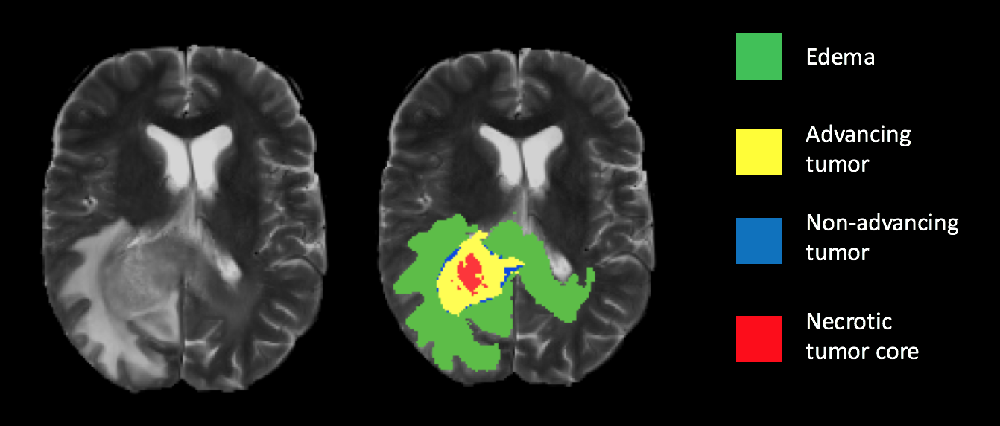

# Brain Tumor Segmentation using an ensemble of 3D U-Nets

Refer to <> for the full report.

## Table of Contents
1. [Team Members](#team-members)
2. [Introduction](#introduction)
3. [Dataset](#dataset)
4. [Model Architecture](##model-architecture)
5. [Results](#results)
6. [Our Contribution](#our-contribution)
7. [References](#references)

## Team Members
1. Sachin Salim (sachinks@umich.edu)
2. Nowrin Mohamed (nowrin@umich.edu)
3. Shrikant Arvavasu (ashri@umich.edu)

## Introduction
Among brain tumors, gliomas are the most common and aggressive, having extreme variations in shape, size and appearance. Automatic and reliable segmentation methods are important because the large amount of data produced by MRI prevents manual segmentation in a reasonable time. In this paper we aim to develop a deep learning model using a 3D U-Net with adaptations in the preprocessing, training and testing strategies. In addition to this, we created an ensemble of multiple models trained with different hyper-parameters that are used to reduce random errors from each model and yield improved performance. Given the limited computational power, three different 3D U-Net architectures are implemented where each model performs better than the other in its own aspects. Furthermore, the ensemble provides better results.

## Dataset
The datasets used in this study are collected by signing up in synapse.org. The data set was made available for research by the BraTS challenge organizers and contains clinically-acquired preoperative multimodal MRI scans of glioblastoma (GBM/HGG) and low-grade glioma (LGG) containing volumes from multiple institutions. The modalities are:
(i) native (T1)
(ii) post-contrast T1-weighted (T1Gd)
(iii) T2-weighted (T2)
(iv) Fluid Attenuated Inversion Recovery (FLAIR)

  
<sub>Ground truth segmentation overlay on a T2 weighted scan. </sub> 

## Model Architecture
|  |
|:--:|
| <b>3D U-Net Architecture</b>|

U-Net is a widely used network structure that consists of a contracting and a symmetric expanding path that enables segmentation for the entire input image[3]. In practice, it is very challenging to achieve a single “optimized” model and thus, an ensemble of multiple models can generally improve the segmentation accuracy[4]. In this paper, we propose three different 3D U-Nets with different hyper-parameters and also an ensemble to 3D U-Nets. For each 3D U-Net, the smaller 3D patches will be extracted to minimize memory overhead and also a data reshaping is done where all four modalities of the MRI volume are concatenated together. Furthermore, during testing, a sliding window approach is used to predict class labels with overlap between patches as a testing augmentation method to improve accuracy. Even though many new methods show superior performance, a recent paper  claimed that vanilla U-Net can yield robust and superior performance[5].

We used three different U-Net models with hyperparameters as follows:
Model | N | M | f
--- | --- | --- | --- 
Model1 | 3 | 64 | 64
Model2 | 3 | 96 | 48
Model3 | 4 | 96 | 24

## Results
|  |
|:--:|
| Segmented sub-regions from models 1-3 and the ensemble model is compared with the ground truth for case BraTS2021-00346 |

Performance of the model for the whole tumor (WT) segmentation
Model | Dice Score | Hausdorff Distance
--- | --- | --- 
Model1 | 0.756 | 4.56
Model2 | 0.812 | 4.02
Model3 | 0.804 | 4.33
Ensemble | 0.805 | 3.84

## Our Contribution
Feng et al. explored the idea of ensemble learning by incorporating predictions from multiple models. Though we followed most of their work in this project, there were certain areas where we improvised based on our available resources, time and knowledge. Firstly, the patch extraction method used a probabilistic approach with heuristic weights while extracting random patches from the scan, whereas we first cropped the scans around the neighborhood of the tumor and then extracted uniformly random patches of a fixed size. Secondly, the model was trained on the “dice-loss” averaged over the classes with a 1:3 ratio of weights for the background and foreground classes, which penalizes the model from overly generalizing the segmentation in case of a class imbalance. We decided the weights empirically based on class frequency and relevance. Moreover, our model achieved a good dice score in 30 epochs of training when we incorporated the scheduling of learning rate for the model. 
We also increased the number of dropout layers, but used a lower dropout ratio to keep the overfitting in check. We got rid of the parametric ReLU and used ordinary ReLU instead. We used a batch size of 5 in contrast to the original paper where they’d used 1 during training.

## References
```
1. Muhammad Junaid Ali, Muhammad Tahir Akram, Hira Saleem, Basit Raza, and Ahmad Raza Shahid. Glioma segmentation using ensemble of 2d/3d u-nets and survival prediction using multiple features fusion. In Alessandro Crimi and Spyridon Bakas, editors, Brainlesion: Glioma, Multiple Sclerosis, Stroke and Traumatic Brain Injuries, pages 189– 199, Cham, 2021. Springer International Publishing. 
2. Adria Casamitjana, Santi Puch, Asier Aduriz, and Veronica Vilaplana. 3d convolutional neural networks for brain tumor segmentation: A comparison of multi-resolution architectures. In Alessandro Crimi, Bjoern Menze, Oskar Maier, Mauricio Reyes, Stefan Winzeck, and Heinz Handels, editors, Brainlesion: Glioma, Multiple Sclerosis, Stroke and Traumatic Brain Injuries, pages 150–161, Cham, 2016. Springer International Publishing. 
3. Liang-Chieh Chen, George Papandreou, Florian Schroff, and Hartwig Adam. Rethinking atrous convolution for semantic image segmentation. CoRR, abs/1706.05587, 2017. 
4. Liang-Chieh Chen, George Papandreou, Iasonas Kokkinos, Kevin Murphy, and Alan L. Yuille. Deeplab: Semantic image segmentation with deep convolutional nets, atrous convolution, and fully connected crfs. IEEE Transactions on Pattern Analysis and Machine Intelligence, 40(4):834–848, 2018. 
5. Ozg ¨ un C¸ ic¸ek, Ahmed Abdulkadir, Soeren S. Lienkamp, ¨ Thomas Brox, and Olaf Ronneberger. 3d u-net: Learning dense volumetric segmentation from sparse annotation. In Sebastien Ourselin, Leo Joskowicz, Mert R. Sabuncu, Gozde Unal, and William Wells, editors, Medical Image Computing and Computer-Assisted Intervention – MICCAI 2016, pages 424–432, Cham, 2016. Springer International Publishing. 
6. Jose Dolz, Christian Desrosiers, and Ismail Ben Ayed. 3d fully convolutional networks for subcortical segmentation in mri: A large-scale study. NeuroImage, 170:456–470, 2018. Segmenting the Brain. 
7. Xue Feng, Nicholas J. Tustison, and Craig H. Meyer. Brain tumor segmentation using an ensemble of 3d u-nets and overall survival prediction using radiomic features. CoRR, abs/1812.01049, 2018. 
```
